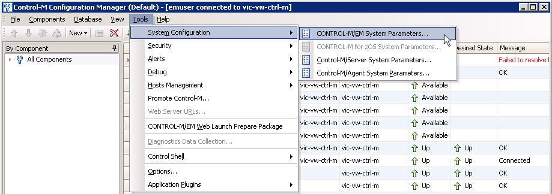
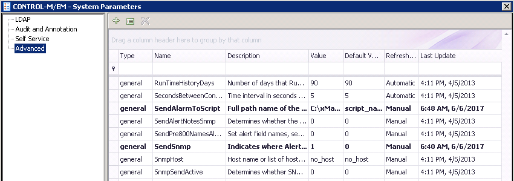
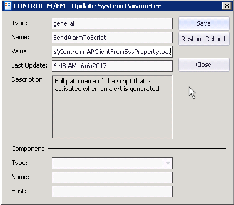
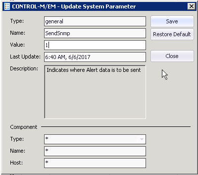
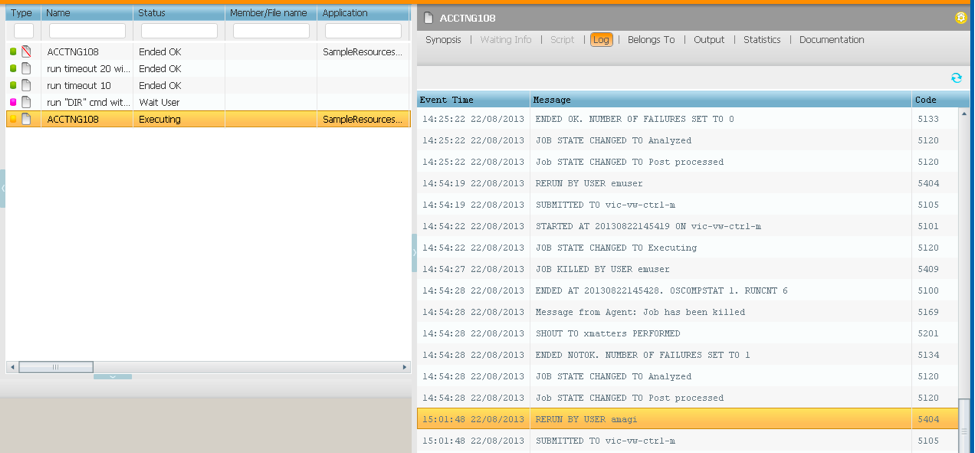

# Control-M v9

## Integration Overview

BMC Control-M delivers is business automation solution that simplifies and automates diverse batch application workloads. When events meet predetermined criteria, this integration with xMatters relays critical BMC Control-M insight data to the correct people and systems to help coordinate and resolve incidents faster. xMatters leverages your group on-call schedules and rotations, escalation rules, and user device preferences to quickly engage the right resources with customizable response and collaboration options.

---------

<kbd>
  
</kbd>

---------


## Automate Handoffs accross your toolcahin

Integrating xMatters with your other tools allows you to automatically transfer key BMC Control-M alert data throughout your systems and drive workflows forward. Notifications and collaboration invites embedded with BMC Control-M insights allow your resolution teams to take immediate action.
  * Create a service management ticket with the BMC Control-M insights
  * Invite people across multiple teams to a conference call with context from BMC Control-M
  * Initiate a targeted chat room via Slack, HipChat or Hubot
  * Record chat room activity back into a service management ticket

# Pre-Requisites
* BMC Control-M Workload Automation v9.0.18 (and above)
* BMC CONTROL-M/EM API v9.0.18 (and above)
* xMatters OnDemand
* xMatters Integration Agent 5.2.2 (and above, including Integratoin Agent Utilities)

# Files
* [Communication Plan](/components/BMCControlMIntegration401.zip)
* [Integration Service](/components/control-m_v401_ia_integration_service.zip)
* [Control-M EM API Documentation](/components/CTM_API_9.0.18.200_509513.pdf)
* [Integration Agent, and Integration Agent Utilities](https://support.xmatters.com/hc/en-us/articles/201463419-Integration-Agent-for-xMatters-5-x-xMatters-On-Demand) (Installation Help is [here](https://help.xmatters.com/ondemand/iaguide/integration-agent-overview.htm?cshid=IntegrationAgent).)

   Note: Here is some additional clarification regarding the Integration Agent Utilities:
   * On [this page](https://help.xmatters.com/ondemand/iaguide/integration-agent.htm) there is a section called “Install and configure the Integration Agent”, and a sub-section called “Install the Integration Agent and IAUtils“ that you will need to follow.
   * To download the Integration Agent Utilities, you need to go to the [Integration Agent for xMatters On-Demand](https://support.xmatters.com/hc/en-us/articles/201463419-Integration-Agent-for-xMatters-5-x-xMatters-On-Demand) downloads page, and get the second item in the table, titled “**Integration Agent Utilities 1.2.9**”.
   * Now, follow the instructions under “Install the Integration Agent and IAUtils” [per above](https://help.xmatters.com/ondemand/iaguide/integration-agent.htm).

# How it works

The Control-M integration leverages a couple of techniques for allowing Control-M and the EM to ask xMatters to initiate an Event and sound out Notifications.  The first and most flexible mechanism is to catch the SNMP traps via the EM such that it calls a command that submits the request to the xMatters Integration Agent via a facility called Apclient.bin.  The other option is to configure Shout destinations which submits events to xMatters Integration Agent via the same Apclient.bin submission mechanism. Once the Integration Agent receives the request, the Event information is securely sent to xMatters via a POST to REST API Entry Point.

# Installation

This document provides information about installing the xMatters (IT) for BMC Control-M Workload Automation integration. This document also contains instructions on how to configure xMatters, BMC Control-M, and the integration components.

## 1. Configuring xMatters

Configuring xMatters to combine with BMC Control-M Workload Automation requires the following steps:

   * Create the REST API User
   * Importing the Communication plan
   * Setting Communication Plan and Form Permissions
   * Access Inbound Integration URL's for use in config.js
   * Access Inbound Integration URL's for use when Configuring Constants
   * Configure Constants

### 1.1 Create the REST API User
To successfully integration and submit to xMatters OnDemand, it is necessary to configure a REST API User in xMatters.

To create an integration user:

1. Log in to the target xMatters system.
2. On the Users tab, click Add.
3. Enter the appropriate information for your new user. Because this user will affect how messages appear for recipients and how events will be displayed in the reports and Communication Center, you may want to identify the user as specific to Control-M; for example:
  * First Name: Control-M
  * Last Name: Integration
  * User ID: controlm.rest
  * Assign the user to the `REST Web Service User`, and `Developer` Roles.
  * Set the user ID and password.
  * Make a note of these details; you will need them when configuring other parts of the integration.
  * Click Save.
  
### 1.2 Importing the Communication Plan
1. Login to xMatters OnDemand
2. Navigate to the Developer tab
3. Import the Control-M [Communication Plan](/components/BMCControlMIntegration401.zip)
4. You should now have a Communication Plan named `BMC Control-M Integration 4.0.1` in the list of Communication Plans

### 1.3 Setting Communication Plan and Form Permissions
   
#### 1.3.1 Access Permissions
1. Login to xMatters OnDemand
2. Navigate to the Developer tab
3. Find the newly imported Control-M Communication Plan `BMC Control-M Integration 4.0.1`.
4. From the Edit dropdown select Access Permisssions
5. Add the REST API User created above, and add any other Users with the Developer Role that will be configuring the integration.

#### 1.3.2 Sender Permissions
1. Login to xMatters OnDemand
2. Navigate to the Developer tab
3. Find the newly imported Control-M Communication Plan `BMC Control-M Integration 4.0.1`.
4. In the Edit drop-down list for the Communication Plan, select Forms
5. For the `Abend` form, click the `Web Service` drop-down list
6. Click `Sender Permissions`
7. Add the REST API user you created above, and then click Save Changes.
Repeat steps 5-7 for the `Run Too Long`, `Complete Too Fast`, and `Command Result` Forms.

#### 1.3.3 Edit Endpoints
1. Login to xMatters OnDemand
2. Navigate to the Developer tab
3. Find the newly imported Control-M Communication Plan `BMC Control-M Integration 4.0.1`.
4. In the Edit drop-down list for the Communication Plan, select Integration Builder
5. Click the Edit Endpoints button to display the endpoints for the integrations.
6. Click the xMatters endpoint
7. Assign the endpoint to the REST API User you created in step 1.1 above
8. Click Save Changes.
  
### 1.4 Collect Inbound Integration URL's for use in config.js
To successfully configure the `config.js` (later on), navigate to xMatters OnDemeand to retrieve the inbound integration URL's for `Inbound Request from IA` and `Trigger Command Result Form`.

1. Login to xMatters OnDemand
2. Navigate to the Developer tab
3. Find the newly imported Control-M communication plan (`BMC Control-M Integration 4.0.1`)
4. Select Edit > Integration Builder
5. From within the Integration Builder, open Inbound Integrations
6. From within the Inbound Integrations, select the link for the `Inbound Request from IA`.
7. Under `How to trigger the integration`, select `Basic Auth` as the Authentication Type
8. Copy the URL that is displayed and use that for the `WEB_SERVICE_URL` variable in `config.js` (later on).
9. Go back to Inbound Integrations
10. From within the Inbound Integrations, select the link for the `Trigger Command Result Form`.
7. Under `How to trigger the integration`, select `Basic Auth` as the Authentication Type
8. Copy the URL that is displayed and use that for the `XMATTERS_CMDRESULT_FORM` variable in `config.js`.
9. That's it for the URLs that are needed for `config.js` (later on).

### 1.5 Collect Inbound Integration URL's for use when configuring Constants
To successfully configure the the `FORM_LOOKUP_ARRAY` Constant used by the scripts in the Communication Plan, we need to collect the URLs for three inbound integrations:

* `Trigger Abend Form`, 
* `Trigger Complete Too Fast Form`, and 
* `Trigger Run Too Long Form`.

These are used directly in the `FORM_LOOKUP_ARRAY` Constant.

1. Login to xMatters OnDemand
2. Navigate to the Developer tab
3. Find the newly imported Control-M communication plan (`BMC Control-M Integration 4.0.1`)
4. Select Edit > Integration Builder
5. From within the Integration Builder, open Inbound Integrations
6. From within the Inbound Integrations, select the link for the `Trigger Abend Form`.
7. Under `How to trigger the integration`, select `URL Authentication` as the Authentication Type
8. For `Authenticating User`, select the REST API User created above.
8. Copy the URL that is displayed and temporarily paste it into a texts editor.  We'll use it later when configuring the `FORM_LOOKUP_ARRAY` Constant.
9. Go back to Inbound Integrations
10. From within the Inbound Integrations, select the link for the `Trigger Complete Too Fast Form`.
11. Under `How to trigger the integration`, select `URL Authentication` as the Authentication Type
12. For `Authenticating User`, select the REST API User created above.
13. Copy the URL that is displayed and temporarily paste it into a texts editor.  We'll use it later when configuring the `FORM_LOOKUP_ARRAY` Constant.
14. Go back to Inbound Integrations
15. From within the Inbound Integrations, select the link for the `Trigger Run Too Long Form`.
16. Under `How to trigger the integration`, select `URL Authentication` as the Authentication Type
17. For `Authenticating User`, select the REST API User created above.
18. Copy the URL that is displayed and temporarily paste it into a texts editor.  We'll use it later when configuring the `FORM_LOOKUP_ARRAY` Constant.
9. That's it for collecting the URLs that are needed by the `FORM_LOOKUP_ARRAY` Constant.

### 1.6 Configure Constants
There are several Constants used by the Inbound Integration scripts.  Most may be left as their defaults, but others must be configured.

To get to the Edit Constants form, do the following:

1. Login to xMatters OnDemand
2. Navigate to the Developer tab
3. Find the newly imported Control-M Communication Plan `BMC Control-M Integration 4.0.1`.
4. In the Edit drop-down list for the Communication Plan, select Integration Builder
5. Click the Edit Constants button to display the Constants editor for the integrations.

The following is the list of all Constants, the ones preceded by an asterisk(*) need to be configured:

| Constant  | Default                       | Description                                            |
|:----------|:------------------------------|:-------------------------------------------------------|
| **`*DISPLAY_TIMEZONE`** | \<PUT YOUR TIMEZONE STRING HERE, E.G. America/New York\> | Timezone to convert to for display purposes (e.g. America/Denver, UTC, etc.).  Valid timezone identifiers are available on [this](https://en.wikipedia.org/wiki/List_of_tz_database_time_zones) page, look undert the **`TZ*`** column.|
| **`*FORM_LOOKUP_ARRAY`** | **See "1.6.1 Configuring the `FORM_LOOKUP_ARRAY`" below for details on how to configure this Consant.** | JSON Object of Form ID to Form URL mapping |
| DISPLAY\_DATE | `ddd, MMM Do, Y`           | Format string to use for Date only values.  See the [Display Format](http://momentjs.com/docs/#/displaying/format/) documentation of Moment.js for Format Token values and meanings.|
| DISPLAY\_DATETIME | `ddd, MMM Do, Y h:mm:ss A z` | Format string for Date and Time values.  See the [Display Format](http://momentjs.com/docs/#/displaying/format/) documentation of Moment.js for Format Token values and meanings.|
| DISPLAY\_TIME | `h:mm:ss A z` | Format string for Time only.  See the [Display Format](http://momentjs.com/docs/#/displaying/format/) documentation of Moment.js for Format Token values and meanings.|
| EMPTY_RECIPIENT | `nobody` | Value to send as the Recipient when no explicit Recipient should be targeted. |
| INCOMING\_TIMEZONE | `UTC` | Timezone of date/time values coming from Control-M. |
| JOB\_ENDED\_OK | `Ended OK` | Job Status representing a successful completion. |
| NAME\_PART\_DELIMITER | `-` | Character between Application, Sub-Application, and Order Folder to create compound Group name. |
| OPT\_DEFAULT\_RECIPIENT\_TO\_<br>APP\_OR\_JOB_NAME | `true` | If `true`, and no explicit Recipient was specified, make a Recipient from combining `application`-`sub_application`-`order_folder` if is missing or `nobody`.  If None of those three values are provided, then defaults to a Group named whatever the value is for `job_name`. |
| OPT\_DELETE\_EXISTING\_EVENTS | `true` | If `true`, delete any existing xMatters events for this order_id before continuing. |
| XMATTERS\_IB\_USE\_WHEN\_NO\_MATCH | `ENDED NOT OK` | Job Status/Form key to use with `FORM_LOOKUP_ARRAY` when no others apply. |

**Save and close the Constants editor once you are finished making any changes.**
   
#### 1.6.1 Configuring the `FORM_LOOKUP_ARRAY`
The `FORM_LOOKUP_ARRAY` is a table that maps a Job Status to an xMatters Inbound Integration representing a Form to use when starting Events to send out Notifications for that Job Status.  The out-of-the-box configuration comes with three Forms that support seven Job Status values.  Note, you can add additional Job Status "keys" and additional xMatters Forms as you need.

You will need to take the URL Values that were collected in Steps 1.5.9 (`Trigger Abend Form`), 1.5.14 (`Trigger Complete Too Fast Form`), and 1.5.19 (`Trigger Run Too Long Form`) and put them between the quatation marks `""` for the associated Job Status value.

Here is what the `FORM_LOOKUP_ARRAY` looks like before it has been configured for your instance:

```
{
	"JOB ENDED NOT OK": "<RELATIVE URL OF 'Trigger Abend Form' WITH API KEY>",
	"JOB RUNS TOO LONG": "<RELATIVE URL OF 'Trigger Run Too Long Form' WITH API KEY>",
	"JOB COMPLETED TOO FAST": "<RELATIVE URL OF 'Trigger Complete Too Fast Form' WITH API KEY",
	"ENDED NOT OK": "<RELATIVE URL OF 'Trigger Abend Form' WITH API KEY>",
	"RUNS TOO LONG": "<RELATIVE URL OF 'Trigger Run Too Long Form' WITH API KEY>",
	"COMPLETED TOO FAST": "<RELATIVE URL OF 'Trigger Complete Too Fast Form' WITH API KEY",
	"WAIT HOST": "<RELATIVE URL OF 'Trigger Abend Form' WITH API KEY>"
}
```

Here's an example of a completely configured version of `FORM_LOOKUP_ARRAY` (NOTE the first part of the URL should be removed, the `https://company.xmatters.com` part):

```
{
	"JOB ENDED NOT OK": "/api/integration/1/functions/90506d5b-7b05-4535-bf9c-b8e95a940a1f/triggers?apiKey=5616e90c-2241-4a05-9a59-e901f6421baa",
	"JOB RUNS TOO LONG": "/api/integration/1/functions/f70a644e-1e84-488f-b06c-2a35dafbbbfe/triggers?apiKey=912386f4-6f76-4d00-9f88-034715da213d",
	"JOB COMPLETED TOO FAST": "/api/integration/1/functions/aff61ea9-3700-4bca-879c-a8f0a408252c/triggers?apiKey=463796da-7079-493c-9b91-ee5fb8f59ea3",
	"ENDED NOT OK": "/api/integration/1/functions/90506d5b-7b05-4535-bf9c-b8e95a940a1f/triggers?apiKey=5616e90c-2241-4a05-9a59-e901f6421baa",
	"RUNS TOO LONG": "/api/integration/1/functions/f70a644e-1e84-488f-b06c-2a35dafbbbfe/triggers?apiKey=912386f4-6f76-4d00-9f88-034715da213d",
	"COMPLETED TOO FAST": "/api/integration/1/functions/aff61ea9-3700-4bca-879c-a8f0a408252c/triggers?apiKey=463796da-7079-493c-9b91-ee5fb8f59ea3",
	"WAIT HOST": "/api/integration/1/functions/90506d5b-7b05-4535-bf9c-b8e95a940a1f/triggers?apiKey=5616e90c-2241-4a05-9a59-e901f6421baa"
}
```

**Save and close the Constants editor once you are finished making any changes.**

## 2. Installation and Configuration of the Integration Service

**Installing the integration service and updating the integration agent**

To configure the integration agent for the BMC Control-M integration, you must copy the integration components into the integration agent; this process is similar to patching the application, where instead of copying files and folders one by one, you copy the contents of a single folder directly into the integration agent folder (\<IAHOME>). The folder structure is identical to the existing integration agent installation, so copying the folder's contents automatically installs the required files to their appropriate locations. Copying these files will not overwrite any existing integrations. This integration includes the following components (in [control-m\_v401\_ia\_integration\_service.zip](/components/control-m_v401_ia_integration_service.zip)):

* **bin/linux/Controlm-APClientFromSysProperty.sh** OR **bin\windows\Controlm-APClientFromSysProperty.bat** 

   Command file targeted by the SNMP trigger from within Control-M. It takes something similar to the SHOUT message and calls APClient.bin.exe with the correct mapping of data for the controlm-401 service.

* **bin/linux/Controlm-APClient.sh** & **bin/linux/Controlm-APClient-Del.sh** OR **bin\windows\Controlm-APClient.bat** & **bin\windows\Controlm-APClient-Del.bat**

   Command files targeted by the SHOUT destinations from within Control-M. They take the SHOUT message and call APClient.bin.exe with the correct mapping of data for the controlm-401 service.

* **conf/deduplicator-filter.controlm.xml**

   The local, Integration Agent specific, filtering mechanism used to suppress duplicate messages. By default, the filter checks the `shout_msg` field; if it gets a duplicate within a 5 second window, it will be suppressed.  The contents of this file should be added to the existing `conf/deduplicator-filter.xml`.

* **conf/bmccontrolm.pwd:** (NOT INCLUDED, Created via bin/iapassword.bat or bin/iapassword.sh)

   Stores the password for the Control-M API user used by the integration service. If you change the name of this file, you must also update the config.js file to point to the correct password file.

* **conf/restuser.pwd:** (NOT INCLUDED, Created via bin/iapassword.bat or bin/iapassword.sh)

   Stores the password for the xMatters User that will be authenticating back to xMatters from the Integration Service.  The associated User ID must have the "REST Web Service User" Role. If you change the name of this file, you must also update the config.js file to point to the correct password file.

* **integrationservices/applications/controlm-401/...:** 

   The files and folders that make up the heart of the Integration Service.

* **integrationservices/applications/controlm-401/classes/...:** 

   These are the .jar files from the EMAPI-918 installation.  If you upate the installation to a newer version, please copy and overwrite the files that are here from the new EMPAP-xxx installation.
   
* **bc-fips-1.0.1.jar Must be copied to \<IAHome>/lib/** 
   **IMPORTANT** Please copy the file “bc-fips-1.0.1.jar” from \<IAHome>/integrationservices/applications/controlm-401/classes/ to <IAHome>/lib/.
   
   If you do not do this you will see errors like this in the IntegrationAgent.txt log file:
   
   ```
2018/12/14 11:26:00.390 -0600 CST [WrapperSimpleAppMain] FATAL - Exit code 87: The Mule server could not be started because an error of type class java.lang.NoSuchMethodError occurred.  Reason: org.bouncycastle.crypto.CryptoServicesRegistrar.setApprovedOnlyMode(Z)Z
com.alarmpoint.integrationagent.exceptions.ExitCodeException: Exit code 87: The Mule server could not be started because an error of type class java.lang.NoSuchMethodError occurred.  Reason: org.bouncycastle.crypto.CryptoServicesRegistrar.setApprovedOnlyMode(Z)Z
	at com.alarmpoint.integrationagent.boot.IAServer.startMule(IAServer.java:307)
	at com.alarmpoint.integrationagent.boot.IAServer.main(IAServer.java:99)
	at sun.reflect.NativeMethodAccessorImpl.invoke0(Native Method)
	at sun.reflect.NativeMethodAccessorImpl.invoke(NativeMethodAccessorImpl.java:62)
	at sun.reflect.DelegatingMethodAccessorImpl.invoke(DelegatingMethodAccessorImpl.java:43)
	at java.lang.reflect.Method.invoke(Method.java:498)
	at org.tanukisoftware.wrapper.WrapperSimpleApp.run(WrapperSimpleApp.java:240)
	at java.lang.Thread.run(Thread.java:745)
Caused by: java.lang.NoSuchMethodError: org.bouncycastle.crypto.CryptoServicesRegistrar.setApprovedOnlyMode(Z)Z
```

* **integrationservices/applications/controlm-401/config.js:** 

   The main configuration file for the integration; includes API connection information and user information.  This is the only file under the controlm-401/ folder that you will need to configure as part of setting up the integration.


Once you have installed the files and folders, you will need to modify the **integrationservices/applications/controlm-401/config.js** and **conf/IAConfig.xml** files to suit your deployment configuration.

_**Note:** If you have more than one integration agent providing the BMC Control-M service, repeat the following steps for each one._

**To install the integration service:**

1. Extract and copy all of the contents of the [control-m\_v401\_ia\_integration\_service.zip](/components/control-m_v401_ia_integration_service.zip) archive file to the \<IAHOME\> folder.

2. Open the IAConfig.xml file found in \<IAHOME\>/conf and add the following line to the “service-configs” section: <path>applications/controlm-401/controlm.xml</path>

3. Open the config.js file (now located under the \<IAHOME\>/integrationservices/applications/controlm-401/ folder), and set the values for the following variables:
   * **CONTROL\_M\_USER:** The user name to be used for the BMC Control-M API Server.
   * **CONTROLM\_PASSWORD\_FILE:** Location of the encrypted password file mentioned above with the [iapassword utility](https://help.xmatters.com/ondemand/iaguide/iapasswordutility.htm) for the Control-M API user; default value is "conf/bmccontrolm.pwd".
   * **CONTROL\_M\_HOST\_PROTOCOL:** Protocol (HTTP or HTTPS) to use when accessing the BMC Control-M API Server (default: http).
   * **CONTROL\_M\_HOST\_NAME:** Hostname of the BMC Control-M API Server (default: localhost).
   * **CONTROL\_M\_HOST\_PORT:** Port to reach Control-M EM Web Service (default: 8080).
   * **INITIATOR:** Identifies the User ID for the xMatters REST User that will be sending requests via WEB\_SERVICE\_URL and XMATTERS\_CMDRESULT\_FORM
   * **PASSWORD:** Identifies the location of the [iapassword utility encrypted](https://help.xmatters.com/ondemand/iaguide/iapasswordutility.htm) password for the xMatters REST User (`INITIATOR`) that will be sending requests via WEB\_SERVICE\_URL and XMATTERS\_CMDRESULT\_FORM
   * **SLEEP\_PERIOD\_BETWEEN\_CALLBACK:** The amount of time (in milliseconds) to sleep between receiving a SHOUT Message and making the callback to the BMC Control-M API for the job details. (Default is 3000, or three seconds.)
   * **DEDUPLICATOR\_FILTER:** Name of the deduplicator filter; i.e., the attribute name for the element filter in the deduplicator-filter.xml file. The default value is controlm-401.
   * **WEB\_SERVICE\_URL:** This value, collected in Step 1.4.8 above, specifies the Integration Builder Entry Point used to inject events into xMatters.  The name of the Inbound Integration in question is `Inbound Request from IA`. The actual variable is defined previously, we are just setting the value here.  E.g. `https://<yourco>.xmatters.com/api/integration/1/functions/4dc45f97-5dd1-4398-b4ce-ec96bf0356ef/triggers`.   (See [this article](https://help.xmatters.com/ondemand/xmodwelcome/integrationbuilder/generate-urls.htm) for help on getting the address of an Inbound Integration.)
   * **XMATTERS\_CMDRESULT\_FORM:** This value, collected in Step 1.4.12 above, specifies the Integration Builder Entry Point used to send Command Results back to xMatters.  The name of the Inbound Integration in question is `Trigger Command Result Form`.  E.G. `https://advisors.na5.xmatters.com/api/integration/1/functions/d6d4800f-7f49-4784-bbc2-e6f4091e89e1/triggers`.  (See [this article](https://help.xmatters.com/ondemand/xmodwelcome/integrationbuilder/generate-urls.htm) for help on getting the address of an Inbound Integration.)

4. Save and close the file.

5. Open and edit the following three command files:
    * Windows: Controlm-APClientFromSysProperty.bat, Controlm-APClient.bat and Controlm-APClient-Del.bat files (now located in `<IAHOME>\bin\windows` ) in a text editor, and change the value for the "IAHOME" variable to the location of the `<IAHOME>` folder on your machine. (This typically is `C:\PROGRA~1\xmatters\integrationagent-5.2.2`).
    
    * Linux: Controlm-APClientFromSysProperty.sh, Controlm-APClient.sh and Controlm-APClient-Del.sh files (now located in `<IAHOME>/bin/linux` ) in a text editor, and change the value for the "IAHOME" variable to the location of the `<IAHOME>` folder on your machine. (For example, if installed as the ctm\_em user, it may be `/home/ctm_em/xmatters/integrationagent-5.2.2`).

6. Save and close the files.

7. Restart the integration agent. 

On Windows, the integration agent runs as a Windows Service; on Linux, it runs as a Linux daemon.  See the section titled `How to start the Integration Agent as a service or daemon` on [this page](https://help.xmatters.com/ondemand/iaguide/integration-agent.htm) for help.

## 3. Installing Control M/EM API files

### 3.1 EM API Install
This procedure describes how to install Control-M/EM API on Windows and Linux. 

Due to Java limitations, BMC Software recommends that you do not install Control-M/EM API in a directory with a path that contains spaces or other special characters. If you install Control-M/EM API on an account where an earlier version of Control-M/EM API is installed, see attached [Control-M/EM API pdf](/components/CTM_API_9.0.18.200_509513.pdf) before continuing. 

**Before you begin**
Ensure the following is installed: 

   * Control-M/EM in your network environment 
   * Java Developer's Kit (JDK) version 1.8.x or later or Java Runtime Environment (JRE) version 1.8.x or later on the computer hosting your project's working directory. `JAVA_HOME` environment variable should point to the JDK/JRE directory/library.

_**Note:** The `JAVA_HOME` environment refers to the directory where the JRE is installed. The JDK contains the JRE, but at a different level in the file hierarchy. For example, if the Java 2 SDK or JRE was installed in `/home/ctm_em`, `JAVA_HOME` would be either:`/ctm_em/jdk1.8.x/jre [JDK]` or `/home/ctm_em/jre1.8.x [JRE]`.

**To Install Control-M/EM API:** 

Do one of the following to create the **emapi-918** directory:

* **Microsoft Windows:** Unzip the `emapi-918-nt.zip` file from the cd `Path/Setup_files/TOOLS/EMAPI_FILES` directory on the Control-M/EM installation CD to any location.
* **LInux:**
   * RedHat or Suse: Locate the `emapi-918-UNIX.TAR.gz` tar file in the `cdPath/Setup_files/TOOLS/EMAPI_FILES` directory on the Control-M/EM installation CD and type the following command to open and uncompress the file to any directory: 

      `-gunzip -c cdPath/TOOLS/EMAPI_FILES/emapi-918-UNIX.TAR.gz | tar xvf-`
 
All Control-M/EM API files and sub-directories are located in this directory. See attached Control-M/EM API primary subdirectories.

You need to run the `emapi-configure.sh` utility to make sure it configures the `communications.xml` file.

_**NOTE:** To uninstall Control-M/EM, delete the Control-M/EM API directory according to your version. For example, for version 9.0.18 delete the emapi-918 directory. Do not copy the Control-M/EM API version 9.0.18 files directly over the previous installation This may cause unpredictable behavior._

### 3.2 Configure xMatters Integration Agent

Once you install and configure the Control-M/EM API, it will put the `<ServerURL>` into the `communications.xml` file.  You can use that value to configure the **CONTROL\_M\_HOST\_PROTOCOL**, **CONTROL\_M\_HOST\_NAME**, and **CONTROL\_M\_HOST\_PORT** above.  

This version of the integration already has the v9.0.18 EM API .jar files installed under `<IAHOME>/integrationservices/applications/controlm-401/classes`, and the `xmldata` folder has also been copied to `<IAHOME>/integrationservices/applications/controlm-401/xmldata`.  If you update the version of EM API, then you may need to update those files and locations accordingly.

## 4. Updating the user password

The password for the BMC Control-M user is stored in an encrypted password file, stored in the <IAHOME>/conf subfolder. For the integration to connect to the API, you will have to replace the default value ("password") with the password of the database user specified in the controlm-config.js file (as described in the table above.)

_**Note:** For more information about the integration agent's IAPassword feature used to encrypt the password, see the xMatters integration agent help on this topic [here](https://help.xmatters.com/ondemand/iaguide/iapasswordutility.htm)._

To change the encrypted password:

1. Navigate to the <IAHOME>/bin subfolder, and then run the following command, replacing <newPassword> with the password of the BMC Control-M user:

   `./iapassword.sh --new "<newPassword>" --file conf/bmccontrolm.pwd`

2. For the xMatters Integration User run the following command, replacing <newPassword> with the password of the xMatters REST user:

   `./iapassword.sh --new "<newPassword>" --file conf/restuser.pwd`

_**Note:** that if you want to change this password again, you will have to either delete the existing file first, or include the `--old <existing password>` in the above command with the existing password._

## 5. Configuring BMC Control-M Workload Automation

The following sections describe how to configure BMC Control-M to combine with xMatters.

As mentioned above, there are two approaches to configuring Control-M to communicate using xMatters: the `Shout` Technique, and the `SNMP Trap` Technique.<br>They are mutually exclulsive; that is, only choose and configure one approaach or you may get duplicate event injections (e.g. if you Shout on an Abend and also get an SNMP Trap, both will send a notification).<br>**The `SNMP Trap` Technique is by far the most flexible for organizations with a large number of jobs.**

### 5.1 Shout Technique

#### 5.1.1 Define shout destinations

The first step in configuring BMC Control-M is to specify the destinations for the xMatters and xMattersDel shout destinations.

**To define shout destinations:**

1. In the BMC Control-M Workload Automation Configuration Manager, open the Shout Destinations Manager.

2. Select  Actions > Add Shout table (or  Update Shout Table to modify an existing table).

3. Add a Shout Destination with the following properties:

   * **Logical Name:** xMatters
   * **Address:** Server
   * **Destination:** Program
   * **Value:** Type the location of the integration agent's bin folder where the Controlm-APClient.bat file was installed; for example:

    `C:/PROGRA~1/xmatters/integrationagent/bin/Controlm-APClient.bat`

   <kbd>
     
   </kbd>


4. Add another Shout Destination with the following properties:

   * **Logical Name:** xMattersDel
   * **Address:** Server
   * **Destination:** Program
   * **Value:** Type the location of the integration agent's bin folder where the Controlm-APClient-Del.bat file was installed; for example:

   `C:/PROGRA~1/xmatters/integrationagent/bin/Controlm-APClient-Del.bat`
   
#### 5.1.2 Using shout destinations

Once you have defined the shout destinations, you can add them to a job in your system. The xMatters shout (Controlm-APClient.bat) sends notifications into xMatters, and allows users to take actions depending on the current state of the job when the notification is sent. The xMattersDel shout (Controlm-APClient-Del.bat) is used to clean up outstanding notifications; you can use this when a job ends with an OK state to remove any outdated notifications from xMatters.

##### 5.1.2.1 To use the xMatters shout destination for a job:
   
   1. In the BMC Control-M Workload Automation Configuration Manager, open the job to which you want to add the shout destination.

   2. Open the **Actions** tab, and add an On-Do Action for the job.

   3. In the **On** drop-down list, select the action you want to use as the trigger for the notification.

   4. In the **Do** drop-down list, select Notify.

   5. In the **Destination** field, select xMatters, and select an Urgency.

   6. In the **Message** field, type `%%ORDERID` and then use the following syntax to specify the recipients and any custom message you want to add:

   `%%ORDERID;<GroupID1>,<UserID2>;<message>`

   Note that you must use semi-colons (;) to separate the components in the message field, and commas (,) to separate the xMatters User IDs that identify the recipients. For example:

   `%%ORDERID;bsmith,cogrady,admin;The job was completed and assigned.`

   <kbd></kbd>

   7. Click OK  to save the action.

##### 5.1.2.2 To use the xMattersDel shout destination for a job:

   1. In the BMC Control-M Workload Automation Configuration Manager, open the job to which you want to add the shout destination.

   2. Open the **Actions** tab, and add an On-Do Action for the job.

   3. In the **On** drop-down list, select the action you want to use as the trigger.

   4. In the **Do** drop-down list, select Notify .

   5. In the **Destination** field, select xMattersDel , and select an Urgency .

   6. In the **Message** field, type `%%ORDERID`

   7. Click **OK** to save the action.


### 5.2 The SNMP Trap Technique

#### 5.2.1 Configuring

   * Install the Control-M integration as described above, but don't configure the shouts or even the shout tables if you don't want to.
   * Either directly reference, or copy the either `<IAHOME>/bin/Controlm-APClientFromSysProperty.sh` or `<IAHOME>\bin\Controlm-APClientFromSysProperty.bat` to somewhere and ensure that the execute permissions are such that the Control-M user can execute it.  (**NOTE: We are assuming that you have installed the xMatters Integration Agent on the same server as the Control-M Enterprise Manager.**)
   * Configure the variables at the top of this script
   
   | Variable  | Default                       | Use                                               |
   |:----------|:------------------------------|:--------------------------------------------------|
   | RECIPIENT | `nowhere`                     |This is the target group or user in xMatters that all notifications will be sent to.<br>To have all notifications go to one group name it here.<br>To have notifications go to nobody to enable management of targets in xMatters with subscriptions create an empty group in xMatters and name it here.<br>To define multiple targets separate them with a ','|
   | CLIENT    | `applications\|controlm\-401` |This is the name of the event domain, or event domain and integration service, you have installed the integration into on the Integration Agent.<br>Usually the default should suffice.|
   | IA_HOME   | -                             |Wherever you've installed your Integration Agent.<br>There should at least be a bin and log directory here.|
   | MAP       | `--map-data`                  |Keep this as `--map-data`|</span></td>
   * Open Control-M Configuration Manager
   * Navigate to `Tools` --> `System Configuration` -->`CONTROL-M/EM System Parameters`...<br>
      <kbd></kbd>
   * Go to Advanced<br>
      <kbd></kbd>
   * Find the System Parameter named `SendAlarmToScript` and edit it.
   * Change the Value to be the full path to the `Controlm-APClientFromSysProperty.sh` (Linux) or `Controlm-APClientFromSysProperty.bat` (Windows) script you have placed on the server.
   * Save and Close.<br>
      <kbd></kbd>
   * Next, find the System Parameter named `SendSnmp` and edit it.
   * Change the Value to 1.
   * Save and Close.<br>
      <kbd></kbd>
   * You must now restart the Control-M gateway service.
      * From the Administration Facility, Select the Gateway.
      * Set the Desired State to Down (click the down-arrow button).
      * Wait for the Current State to indicate Down.
      * Set the Desired State to Up (click the up-arrow button).
      * Wait for the Current State to indicate Up.</li>
   * You're done!

   Anytime a message goes into the EM in Control-M it will trigger the script to run and cause an event to be created in xMatters - Give it a test!

#### 5.2.2 Assumptions

* You have installed have installed the xMatters integration for Control-M on an integration agent local to where the Control-M EM runs.
* You have configured all of the integration except for the shout table and shout definitions in Control-M.
* This assumes you're using an integration that expects as the first argument the format **{Job Order ID};{Recipient};{Condition Message}**, or **{Job Order ID};{Recipient};{Condition Message};{Severity}**.
* If Control-M generates an SNMP Trap when the job ends normally, xMatters will End any existing events matching that `Job Order ID`.

#### 5.2.3 What's going on here?

The standard Control-M integration for xMatters is designed to receive a string from a shout in Control-M. Shouts are configured on a job by job basis in Control-M.  The string passed to the command is defined in each shout and is expect to be: the job order ID, an xMatters recipient ID (specific to that shout), and a message detailing the current situation (also specific to the shout).  The Control-M 'DataCentre' is also passed through to the command invoked by the shout.  Ordinarily a batch or shell script is invoked by the shout, the script finds the xMatters Integration binary and passes the arguments it has received unchanged.  The Control-M integration then does the work to split out the parts of the string and calls the Control-M API to get more information about the affected job.

Control-M (or rather the EM) can also invoke a script for every event that goes to the event console if this is defined in the Control-M System Properties.  This process is separate and in addition to the shout definition.  The attached scripts can be used to take the arguments passed by this other method and find in them the job order ID, the message in the EM referring to the current situation and the Control-M 'DataCentre'.  The script will then build the string as if it had come from a shout and invoke the xMatters Control-M Integration in the way it is expecting. The integration will then deal with getting more information from the Control-M API in the usual way.

#### 5.2.4 Why would you want to do this?

So as far as the xMatters Integration knows the incoming arguments and the following process is the same for both methods.  There are several notable differences though:

* Using the shout method some jobs can be configured to use the integration while some will not.  With this method all job failures invoke the integration.
* Using the shout method a different target can be used for each job and this is defined in Control-M within the shout definition.  With this method one recipient is used for all events.  Subscriptions in xMatters can then be used to send notifications to other additional users and groups.
* Using the shout method a different message describing the situation can be used for each job and this is defined in Control-M in the shout it's self.  With this method the message is taken from the Control-M EM description of the problem and is not dynamic.
* Using the shout method you can terminate the xMatters event when the condition in Control-M clears. Depending on whether or not SNMP Traps are generated for successful completion, it's not clear whether or not this is possible with this method on it's own.

With that in mind this is not necessarily a replacement for the Shout method that is also supported by this integration.  This is an alternative method that can be used particularly when:

* You have a large number of jobs (1000s) and need an event for every job failure.
* You want to configure targets for the notifications in the xMatters GUI using Subscriptions.
* You don't want to go through every job in an existing batch schedule configuring shouts.
* You simply want all notifications about Control-M jobs to go to the same group in xMatters.

## 6. Configuration Validation

The following sections will test the combination of xMatters and BMC Control-M for notification delivery and response.

After configuring xMatters and BMC Control-M, you can validate that communication is properly configured. It is recommended that you start the components in the following order:

   * BMC Control-M
   * xMatters integration agent
   * xMatters

### 6.1 Triggering a notification

To trigger a notification, run a new job in BMC Control-M, and cause it to enter a state for which you have either defined an xMatters Shout Message for, or will be caught via the SNMP Trap:

<kbd>
  
</kbd>

### 6.2 Responding to a notification
This section describes how to respond to a notification from xMatters. In the following example, the notification is
received in an email, but the process is similar for all Devices.

**To respond to a notification:**

1. When a notification arrives for the User, open it to view the details:
2. The list of possible replies is located at the bottom of the notification. For email notifications, click one of the
response option to send your response to BMC Control-M.
Note that in the default integration configuration, you can also select response options to retrieve information about
the job from BMC Control-M.
3. To view the results of the response, view the job report details in BMC Control-M. In the following image, you can
see that the notified user selected the "Rerun" response option, causing the job to be rerun:
<kbd>
  
</kbd>

## 7 Troubleshooting
* Consult the [Control-M EM API Documentation](/components/CTM_API_9.0.18.200_509513.pdf) if experiencing any issues related to the Control-M API Installation.
* Consult the [Integration Agent Documentation](https://support.xmatters.com/hc/en-us/articles/201463419-Integration-Agent-for-xMatters-5-x-xMatters-On-Demand) if experiencing any issues related to configuring the Integration Agent
* Consult [xMatters Help](https://help.xmatters.com/) if experiencing any issues within xMatters OnDemand.
